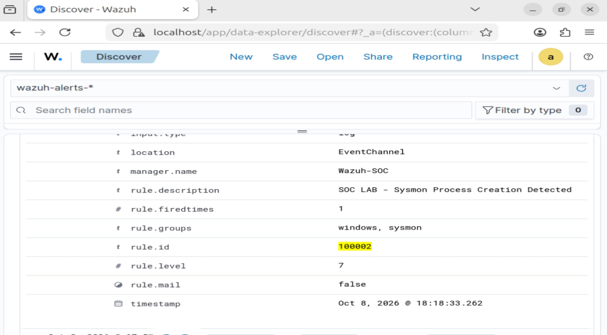

# SOC-analyst-home-lab
SOC Analyst home lab using Wazuh SIEM, Sysmon, Windows endpoint monitoring, custom detections, and incident investigations.
SOC Analyst Home Lab

Overview

I built a Security Operations Center (SOC) home lab to practice security monitoring, endpoint investigation, event analysis, and detection engineering using free tools.

This project demonstrates hands-on experience collecting Windows security telemetry, investigating processes and network connections, and creating a custom detection rule in a SIEM.

Lab Architecture

* SIEM: Wazuh
* SIEM server: Ubuntu 24.04
* Endpoint: Windows 11 ARM64
* Endpoint telemetry: Sysmon
* Analysis tools: Wazuh Dashboard, PowerShell, and Windows networking commands

Lab Network

* Ubuntu/Wazuh server: 10.10.10.10
* Windows endpoint: 10.10.10.20

Projects and Investigations

1. Windows Endpoint Monitoring

* Installed and connected the Wazuh agent to the Wazuh manager.
* Installed Sysmon to collect Windows process activity.
* Verified that Sysmon events were visible in Wazuh.

2. Custom Detection Rule

* Created a custom Wazuh rule with ID 100002.
* Configured the rule to identify Sysmon process-creation events using a built-in Wazuh rule as its parent.
* Validated the configuration and confirmed that a new process event triggered the custom rule.

3. PowerShell Process Investigation

* Examined process-creation telemetry for powershell.exe.
* Reviewed the process image, parent process, process ID, and available command-line details.
* Observed a PowerShell process launching another PowerShell process.
* Documented the evidence and noted that the available information did not establish malicious activity.

4. Windows Network Connection Investigation

* Used PowerShell to inspect established TCP connections.
* Correlated a connection to the Wazuh server on TCP port 1514 with the Wazuh agent process.
* Observed a separate transient external connection that disappeared before its owning process could be verified.
* Documented the unknown connection as unverified rather than labeling it malicious without sufficient evidence.

Skills Demonstrated

* SIEM deployment and event review
* Windows endpoint monitoring
* Sysmon event analysis
* Custom detection rule creation and validation
* Process and parent-child relationship investigation
* TCP connection and process correlation
* PowerShell-based investigation
* Evidence documentation and cautious conclusions

Future Improvements

* Add screenshots of the Wazuh dashboard and custom detection.
* Create additional detection rules and test them with safe lab activity.
* Document further investigations with timelines, evidence, findings, and recommendations.
* Expand the lab with additional log sources and alert triage exercises.

Certification

CompTIA Security+ (SY0-701) — Passed

Disclaimer

This project is for educational purposes and uses a controlled home lab. Investigation conclusions are based only on the evidence collected during each exercise.

Lab Evidence

Custom Wazuh Process-Creation Detection

This screenshot below shows my custom Wazuh rule (100002) triggered on a Sysmon process-creation event during controlled lab testing.

